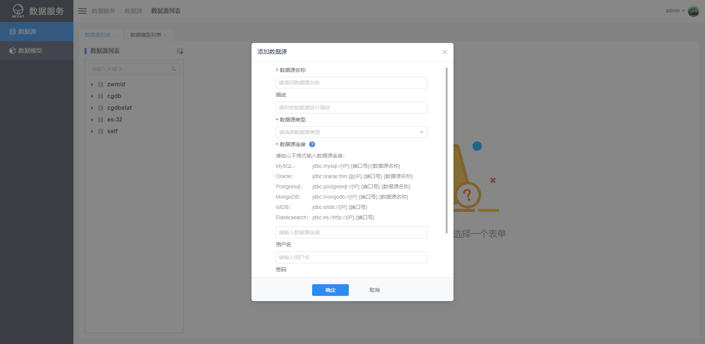
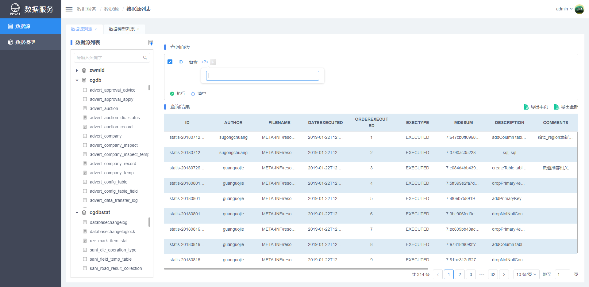
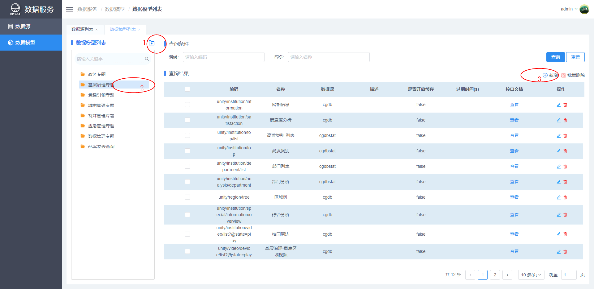
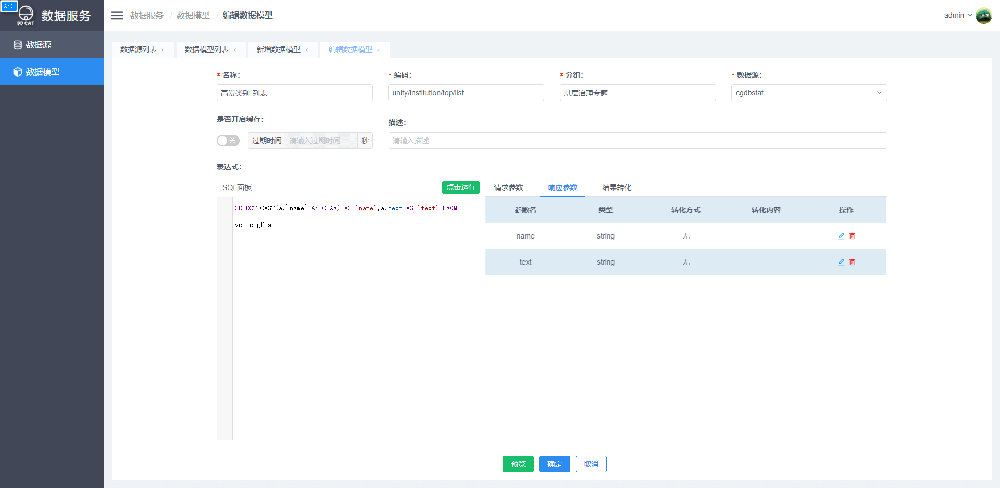
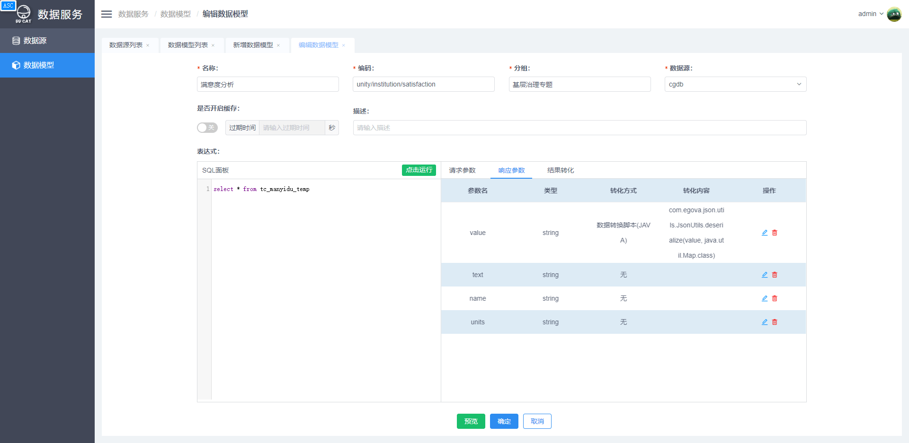
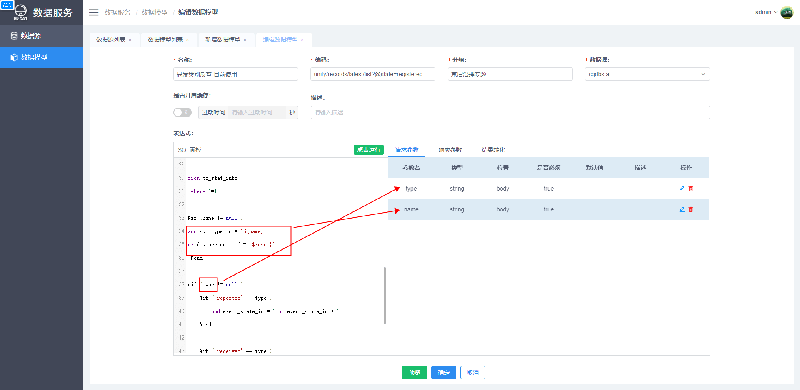
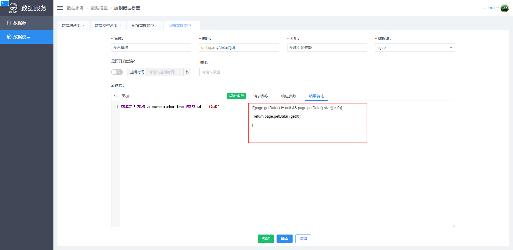

# oh-my-data-web

    数据服务 —— 写个 SQL 即可发布成 API
    UI库使用View Design

## [在线演示地址](http://47.111.102.84:8080/project/ohmydata/#/login)

    admin/123456

## 运行

```
    npm i
    npm run serve
```

## 打包

```
    npm run build
```

## TODO

    页面组件化发布至NPM,其他项目直接使用npm包按需引入所需要嵌入的页面。

<!-- ### [在线示例](https://github.com/sjhleo/vue-preset-template/blob/master/README.md) -->

## [后端服务代码](https://github.com/xuanbo/ohmydata)

## 使用指南

ddcat 最终目的是实现数据库到接口的直接转换。

### 1.数据源配置

对于目前常用的几种数据库，ddcat 几乎都能做到无差别的对接，不同类型的数据源都是使用 mysql 的查询语句进行操作，后台会自动转换为对应的查询语句。在进行接口 sql 配置之前，首先要完成数据源的配置，按照下图示例的格式进行配置。

连接数据源后，会看到一个类似 Navicat 的界面，可以在 sql 面板执行相关查询语句。


### 2.数据模型

具体的数据模型列表界面如下图，一般会新建列表目录对接口进行归类。


新增数据模型， 需要指定相关参数：

-   名称：
    一般对应需要开发模块的名称，易分辨即可，方便维护
-   编码：
    接口的请求路径，注意开头不带斜杠。实际开发中需要去匹配前端对接的路径
-   分组：
    归类，方便维护
-   数据源：
    指定查询的数据库
-   是否开启缓存：
    打开缓存开关，配置过期时间。过期时间内，接口会返回上一次查询 redis 缓存的数据。常用于一些对时效性不高的统计接口，配置后可节约请求服务资源。

-   表达式-sql 语句：
    查询的原始 sql 语句，此处不建议写太复杂的 sql 语句，一般做法是在源数据库建视图，方便接口转换、条件查询等操作，以及方便后期维护。
    

sql 面板 sql 语句完成后，点击执行，会根据语句在右侧生成请求参数、响应参数的列表。此处还可以对查询的结果进行重命名、公式、脚本转换。本文后续会进行更新详细说明。


### 3. 数据模型编辑

#### 1. sql 面板

（1）模板语法

#### 值变量

```
${value}

例子

- select * from xxx where name = '${name}'
- select * from xxx where age = ${age}

注意：对于字符串变量，SQL中需要增加引号；对于数值类型，SQL无需引号

```

#### 条件

```
#if (role == "admin")
 ...
#elseif (role == "user")
 ...
#else
 ...
#end

例子

比如前端传递字符串，而数据库存储的数值枚举

select * from xxx where
#if (role == "admin")
 role = 2
#elseif (role == "user")
 role = 1
#else
 role = 0
#end
```

#### 循环

```
#for (String userId : userIds)
 // 内部循环计数器，从 1 开始计数
 ${for.index}
 ...
#end

例子

比如前端传递数组，数据库查询需要拼接IN查询

select * from com_user
#if (userIds == null)
#else
  where id in (
  #for (String userId : userIds)
    #if (for.index > 1)
    ,
    #end
    '${userId}'
  #end
  )
#end
```

#### 2. 请求参数

（1）定义
sql 面板执行语句中，带有值变量 ${value}的 value 参数，在点击执行后会自动显示到此模块。每次执行后，需要配置参数类型、是否必须、默认值。


#### 3. 响应参数

响应参数在 sql 面板执行 sql 语句后会将此查询得到的结果字段自动显示到此模块。包含了多种转换方式。

（1） 转换方式
对数据结果进行相应的处理

#### 无

```
该字段不做任何处理，无需填写转换内容
```

#### 重命名

```
对该字段重新命名，转换内容为新字段名称。转换内容为新的字段别名。
```

#### 数据转换脚本(JAVA)

```
对该字段值做处理从而返回新的值，转换内容为JAVA代码，value变量为当前字段值（所有当前字段值都为value），最后一行作为返回结果：

# 日期格式转换
import com.flagwind.commons.Monment;
Monment.parseDate(value, "yyyy-MM-dd hh:mm:ss").toString("yyyy-MM-dd hh:mm")

# 字符串json反序列化
com.egova.json.utils.JsonUtils.deserialize(value, java.util.Map.class)

# 字符串json数组反序列化
com.egova.json.utils.JsonUtils.deserializeList(value, java.util.Map.class)


```

#### 数据转换脚本(公式)

```
对该字段值做处理从而返回新的值，转换内容为公式：

# 目前公式如下，公式支持嵌套，'#{value}'为当前字段值

# 将日期对象（或者符合日期格式的字符串）转为时间戳
TIMESTAMP('#{value}')

# Date对象（或者符合日期格式的字符串）转为指定的时间字符串
DATE_FORMAT('#{value}', 'yyyy-MM-dd hh:mm:ss')

```

#### 级联(一对一)

```
对该字段值做数据库二次查询，返回对象

# 语法
table,column,newColumn,column1:alias1;column2:alias2;...

# 说明
查询表名,查询字段,命名字段,表字段1:别名1;表字段2:别名2;...

其中，后面的 `column1:alias1;column2:alias2;...` 为别名映射，可选

比如当前字段为 personId，需要根据 personId 查询出 person 信息：

com_person,id,person

如果要修改别名：

com_person,id,person,name:name1
```

#### 级联(一对多)

```
对该字段值做数据库二次查询，返回数组

table,column,newColumn,column1:alias1;column2:alias2;...

其中，后面的 `column1:alias1;column2:alias2;...` 为别名映射，可选

比如当前字段为userId，需要根据userId查询出roles信息：

com_role,userId,roles
```

#### 4. 结果转换

java 代码完成对 sql 查询结果的最后一轮转换。

（1）返回数据格式准换

```
ddcat默认返回的结构是数组对象格式
{
  "hasError": false,
  "result": [
    {
     ...
    },
    {
      ...
    },
    {
      ...
    }
  ],
  "message": null,
  "messageList": [],
  "tag": null,
  "totalCount":
}

结果转化的java代码：

if(page.getData() != null && page.getData().size() > 0){
  return page.getData().get(0);
}

用结果转换功能准换为单个对象：
{
  "hasError": false,
  "result":
    {
     ...
    },
  "message": null,
  "messageList": [],
  "tag": null,
  "totalCount":
}
```

即默认 result 返回的是数组对象格式。如果需要返回单个对象，则必须使用 java 代码获取列表的第一 个对象返回。


page 即为后台 sql 查询后的结果。为了方便理解，下图展示了 page 对应的后台实体：

```

@Data
public class Page<T> {

    public static final Integer DEFAULT_PAGE_INDEX = 1;
    public static final Integer DEFAULT_PAGE_SIZE = 10;

    private Integer pageIndex;

    private Integer pageSize;

    private Long totalCount;

    private List<T> data;

    public Page() {
        this.pageIndex = DEFAULT_PAGE_INDEX;
        this.pageSize = DEFAULT_PAGE_SIZE;
        this.totalCount = 0L;
    }
	....
```

一个比较复杂的结果转换代码示例：

```
List<Map<String, Object>> data = page.getData();
List<Map<String, Object>> list = new ArrayList<>();
for (Map<String, Object> datum : data) {
    Map<String, Object> newMap = new HashMap<>();
    if (datum instanceof Map) {
        Map<String, Object> oldMap = (Map) datum;
        for (Map.Entry<String, Object> entry : oldMap.entrySet()) {
            String key = entry.getKey();
            Object value = entry.getValue();

            String[] split = key.split("\\.");

            if (split.length > 1) {
                String column = split[0];
                String bb = split[1];
                Map itemMap = (Map) newMap.getOrDefault(column, new HashMap<>());
                itemMap.put(bb, value);
                newMap.put(column, itemMap);
            } else {
                newMap.put(key, value);
            }
        }
    }
    list.add(newMap);
}
page.setData(list);
return page;
```

此示例代码完成了，字段名称带 "." 的字段转换为 map 对象。例如

```
"subType.text" : "户外广告",
"subType.value" : "456",

转化为
"subType":{
	"text":"户外广告",
	"value":"456"
  }
```

可根据实际情况进行转换代码编写。
